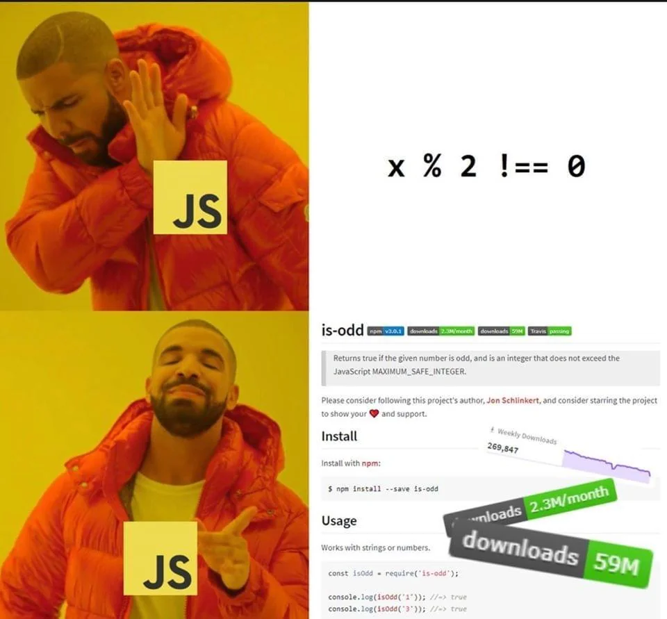

# React Dev Camp – Session 1: Foundations

---

## 👋 Welcome

### 👨‍💻 Who’s involved

* Session led by: Jason
* Supporting behind the scenes:

  * Anre Eybers
  * Roelof Jooste
  * Herco Bezuidenhout
  * Goltz Wessmann

This dev camp is supported by a group, not just a single presenter. Feel free to reach out to any of us during or after the sessions.

---

### 🙌 Setting expectations

* React experience here is around 2 years — still learning like everyone else
* It’s impossible to know everything in this space
* If something comes up that we don’t know, that’s completely fine

If anyone in the room has insight or experience to share, please jump in — the goal is shared learning.

---

## 🧭 Session Flow

* We’ll alternate between theory and practical
* Theory = mental models
* Practical = how it actually works

---

# 🧠 Part 1: What is Node.js?
[🔗 Node website](https://nodejs.org/en)

**Core idea:**
Node.js lets us run JavaScript outside the browser.

* Normally JavaScript runs in the browser
* Node.js allows it to run on your machine (server-side)
* This is what powers modern frontend tooling

**Analogy:**

* Think of Node.js like the JRE (Java Runtime Environment)
* It’s what allows your code to execute

**Key takeaway:**

* React apps don’t run on Node, but they depend on tools that do

---

# 🧠 What is npm?
[🔗 Npm docs](https://docs.npmjs.com/about-npm)

**Core idea:**
npm is how we install and manage external code.

* We don’t write everything from scratch
* We install packages built by others. Registry: https://www.npmjs.com/
* npm helps us manage those packages

**Analogy:**

* Like Maven / Gradle / NuGet
* Central place for dependencies + CLI tool to install them

Example:

```
npm install awesome-dev-jokes
```

**Just don't do this:**



---

# 🧠 package.json

**Core idea:**
This is the configuration file for your project.

* Tracks dependencies
* Defines scripts
* Describes the project

Example:

```json
{
  "name": "my-app",
  "version": "1.0.0",
  "scripts": {
    "start": "node index.js"
  }
}
```

**Analogy:**

* Like a pom.xml (Maven) or .csproj file

---

# 🧠 Dependencies

**Core idea:**
External code your app relies on

* dependencies → needed when app runs
* devDependencies → only needed during development

**Examples:**

* React → dependency
* Testing tools / build tools → devDependencies

**Analogy:**

* dependencies = ingredients
* devDependencies = kitchen tools

---

# 🧠 node_modules

**Core idea:**
Where installed packages live

* Created automatically
* Can get very large
* Not committed to git

Deleting this folder and running `npm install` will restore everything.

---

# 🧠 Scripts

**Core idea:**
Shortcuts for commands

* Define commands once
* Run them easily

Example:

```
npm run start
```

**Analogy:**

* Similar to build/run commands in Maven/Gradle

---

# 🛠️ PRACTICAL 1: Node & npm

## Goal

Create a basic Node project and use a package

---

## Step 1: Initialise project

```bash
mkdir dev-camp-demo
cd dev-camp-demo
npm init -y
```

* `-y` skips prompts for speed
* Open package.json after creation

---

## Step 2: Install a package

```bash
npm install awesome-dev-jokes
```

* node_modules is created
* package.json is updated automatically

---

## Step 3: Use the package

Create `index.js`:

```js
const Joke = require('awesome-dev-jokes');
 
console.log(Joke.getRandomJoke());
```

Run:

```bash
node index.js
```

---

* npm registry = where packages come from
* require = importing code
* package.json updates automatically

### _Node.js wrap_

Everything we need to know for now:
* `package.json` → config
* `scripts` → shortcuts
* `dependencies` → what we use
* `node_modules` → where they live

---

# ⚛️ Part 2: What is React?

**Core idea:**
React is a library that helps us build user interfaces using components.

* Instead of manually changing the DOM
* We describe what UI should look like
* React updates it efficiently
* React is a package that is imported into a node project

**Key takeaway:**

* Focus on what the UI should look like, not how to update it step by step
* Think of UI as a function of data
* When the data changes → the UI updates
* That’s the core idea behind React


---

# 🧠 React Concepts

**Components**

* Reusable pieces of UI
* Like building blocks

**Analogy:**

* Similar to reusable classes/components in Java/C#

**Props**

* Data passed into components

**Analogy:**

* Like method parameters

**State**

* Data that changes over time

**Analogy:**

* Like internal class variables

---

# 🛠️ PRACTICAL 2: Create React App (Vite)

## Step 1: Create project

```bash
npm create vite@latest react-dev-camp
cd react-dev-camp
npm install
```

---

## Step 2: Start dev server

```bash
npm run dev
```

* Starts a local server
* Auto reloads on changes

---

## Step 3: Clean up starter code

* Remove boilerplate
* Keep it simple

---

## Example Component

````jsx
function Button({ origin, children }) {
  return (
    <button onClick={() => alert(`Hello from ${origin}!`)}>
      {children}
    </button>
  );
}

export default function App() {
  return (
    <div>
      <h1>Hello Dev Camp</h1>
      <Button origin="App">Click me</Button>
    </div>
  );
}

---

### Key concepts while building

**Props**
- Inputs to components
- Makes components reusable

**children**
- Special prop
- Everything between tags

**Event Handling**

```jsx
onClick={() => alert('Clicked!')}
````

* Same idea as JS events
* Written in JSX

---

## 🧠 JSX Differences

### class → className

* `class` is reserved in JavaScript

### for → htmlFor

* Avoids keyword conflicts

---

## 🧠 Styling

### Inline styles

```jsx
<div style={{ color: 'red' }} />
```

* Uses JavaScript object
* CamelCase properties

---

# 💬 Wrap-up

* Node powers tooling
* npm manages dependencies
* React builds UI using components

---

# ❓ Q&A

* What felt confusing?
* What clicked during practical?

---

## 💡 Notes

* Focus on understanding, not memorising
* Most things will become clearer with practice
* The goal is to build a strong foundation
